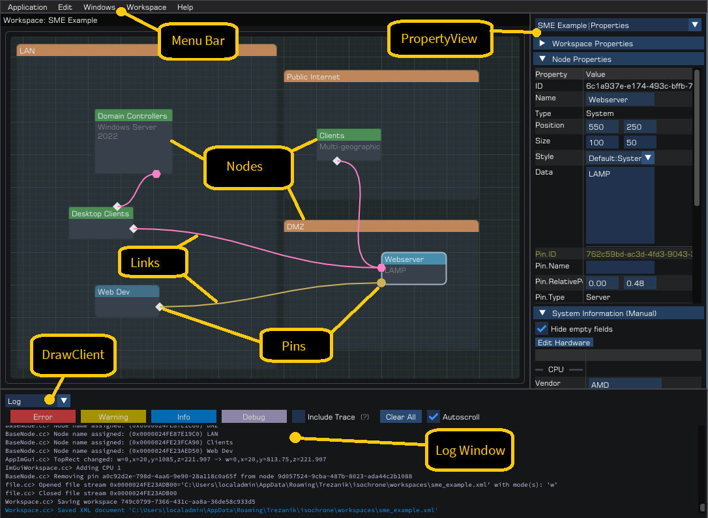

## At a Glance

This project is designed to create network topologies and flows between systems, optionally at a hyper-specific level or as a broad concept, as desired.

Security functions are also included, with focus towards forensic analysis and/or information gathering.

It is geared for suitability for small to medium sized networks.

## Table of Contents

- [Project Status](#Project-Status)
- [Supported Operating Systems](#Supported-Operating-Systems)
- [Dependencies](#Dependencies)
- [Building](#Creating-a-Workspace)
- [Contributions](#Contributions)
- [Assets](#Assets)
- [FAQ](#FAQ)
- [Miscellaneous](#Miscellaneous)

## Project Status

- [x] Proof-of-concept
- [x] Pre-Alpha
- [x] Alpha
- [ ] Beta
- [ ] Release Candidate

This section will be replaced upon initial release.

### Quick Start

See the [application usage guide](docs/using_the_application.md) for how to interact with the application as a first-timer.

## Supported Operating Systems

### Graph/FlowChart

 - Windows XP SP3 (x86) | Windows XP SP2 (x64) **\***
 - Windows Vista SP1 (x86|x64) **\*\***
 - Windows 7 SP1 (x86|x64)
 - Windows 8.1 (x86|x64) _(Windows 8 should be good, but not supported)_
 - Windows 10 (x86|x64)
 - Linux (kernel 2.6+ should be good, i386|amd64, if C++17 available)

> **Windows XP/Server 2003** **\*** has multiple changes required.
> See the dedicated building_for_xp2003 markdown file for the guide and associated details.

> ***Note***
> Any system supporting SDL2 and other dependencies should work

Target remains C++14-compatible, but we'll use C++17 exclusively and workaround for compatibility issues (i.e. potential performance impact when targeting legacy systems). 

Non-Windows requires C++17 for filesystem, as there's no native implementation handler currently.

### Security Functions

 - Windows XP SP3 (x86) | Windows XP SP2 (x64)
 - Windows Server 2003 SP1 (x86|x64)
 - All Windows NT 6.0
 - All Windows NT 6.1
 - All Windows NT 6.2
 - All Windows NT 6.3
 - All Windows NT 10.0

**Since modern development environments do not support older versions, additional steps may be required to get a functional build!**

Primary Windows development has been performed on Windows 7 SP1 x64 and Windows 10 x64 (various branches), and _WIN32_WINNT defaults to 0x601 (Windows 7).

There are no current plans to develop on or officially support Windows 11, but there are also no anticipated problems with running on it.

No restrictions exist on where this can be executed; however naturally due to limitations on development and testing time, not all combinations can be verified. Reports of flaws will be acknowledged and attempted to be resolved on anything equal to or newer than Windows XP (last Service Pack) and Linux Kernel 2.6, on both x86/i386 and x64.

## Dependencies

 - dear imgui (integrated)
 - freetype
 - libpng (TBD)
 - pugixml
 - SDL2
 - SDL2_ttf
 - sqlite3 (secfuncs/optional for RSS)
 - STBI (integrated, optional)
 - zlib

With Audio enabled:
 - ogg (if oggopus and/or oggvorbis enabled)
 - OpenAL-soft
 - opus (if oggopus enabled)
 - opusfile (if oggopus enabled)
 - vorbis (if oggvorbis enabled)
 - vorbisfile (if oggvorbis enabled)

With Networking enabled:
 - openssl
 
 **Pending introduction:**
 - catch2 (unit tests)
 - FLAC

## Building

There are three build systems available:
 - CMake (3.6 or newer required)
 - meson (0.55 or newer required)
 - Visual Studio (2019) raw solution

Visual Studio is Windows-specific; the others can be used on any supported system.
> *A .kdev4 project file also exists in the repository for KDevelop, but this simply uses cmake*

> Autotools used to be included, but it's an abomination. I built the meson script with zero prior experience in less time than it took to attempt to tweak some autotools options, unsuccessfully!
> If someone wants to contribute the autotools setup, I'll happily include it - but won't maintain it. I adore the `./configure, make, make install` routine thanks to consistency and being easy to remember, but setting it up - painful.

### Linux

Tested with CMake and meson. See the [building_for_linux](docs/building_for_linux.md) guide in the [docs](docs) folder for full steps.

### Other Unix-like

Untested, however expect CMake and meson to be able to generate build files, and source requiring minimal to no changes for function.

### Windows

Tested with raw Visual Studio solution and CMake. See the [building_for_windows](docs/building_for_windows.md) guide in the [docs](docs) folder for full steps.

## Contributions

Any contributions will be gratefully received.

My graphics programming knowledge is poor (this project was actually to try and aid in developing it further), so improvements should be easy and plentiful for anyone well-versed in it.
Please see the [code style](docs/code_style.md) in the documentation for the style we use in this project before submitting pull requests. Patch files will also be accepted, including anonymous requests if so desired.

All code must be zlib license compatible, not be 'AI'-generated, and provide suitable callouts for third-party source as per their license requirements.

## Assets

We believe in being completely open and attribute credit to authors - fonts, images and audio files are intended to have licenses for complete exposure.

These are supplied alongside the assets as an additional file of the same name, but with a `.license` extension instead. If the license is not found, the asset will not be loaded - and should not be distributed.

We are not yet compliant with this, but it will be a goal for release.

## FAQ

> Is this project still alive?

Yes! Due to my 'working practices' I have multiple machines used for development, which is unsuitable for pushing directly into a public repository. I periodically sync my private repo with this public one.

I will mark this repository as abandoned if I do cease work on it; if that occurs, or upon my death, I give full consent for adjusting the license into the public domain/MIT, as long as no contributions conflict with the licensing.

> Why are you not officially supporting Windows 11?

I despise the operating system. Windows 10 is irksome but just about tolerable, and undeniably has improved security structure.

Windows 11 offers nothing new of any value beyond further shoving undesired applications, advertisements, and AI towards the user, and lacks key customization desires that existed in prior versions. I expect so much better from enterprise software and do not reward shabby work/cashgrab mentaility, just like games and films in the 'modern' world.

While we won't support the graph node with Windows 11 right now, the security functions will be kept up, otherwise it'd be nigh useless - and there's no reason to suspect anything else will fail to function.

> Why use C++, and why not anything C++20 or newer?

Familiarity. Programming has only ever been a hobby of mine, and I started learning with C++03 and slowly delving into 11/14/17 features (some C++11 items I've only discovered in 2025!). I simply do not have the time to keep up with every new language/development/feature addition, even if I could understand it all.

I've used many other languages (not limited to Ada, Delphi, Java, Perl, Ruby...), but they're not my forté, and with scripting I always feel like something is missing if I'm not speaking to the underlying system natively by going through additional wrappers.

With scripts, I design as a means-to-an-end - whereas native projects I architect. It just feels the right way to do things.

> How long is the NT5 support going to last for? Will this support impact newer systems?

Unknown, but realistically as long as tenable, with no impact on newer systems - it was never in my original design or goals, it simply emerged as an unanticipated option via retaining a lesser C++ version.

I previously had supporting code, so the effort to integrate it was minimal - a few new methods and adjusting legacy code for better modern practices.

With that said, the kernel and API function exposure offers everything we need, and no newer version has (yet) introduced any critical methods to include - things like the new compression algorithms are supporting those specific operating systems for data extraction, so doesn't count towards this.

XP/2003 will obviously become a burden and outright unusable in future - my main minimal support goal is Windows 7 (NT 6.1), preferably retaining NT 6.0, until Windows internals undergoes another significant rewrite or third-party dependencies cause grief.

> Why use imgui as the GUI?

Ah. I needed something cross-platform, and wanted to support Windows 7 still. I've always been fond of the classic GLUI and imgui has a nice consistent UI itself, while directly integrating into 3D applications, such as games - which is a desire I still have. It pretty much served the right purpose at the right time.

Protip if you're thinking of doing this yourself: prepare for pain. After experiencing it, take ocornut at this word - I also do not recommend it for a full-blown UI like we've done!

It's by no means horrible but you will have to handle things like click/drag/contextual operations, which most people will take the existing OS/app library implementations for granted. And as expected, if you want a widget that doesn't yet exist (e.g. vertical tabs), you have to be prepared to implement it yourself - optionally replacing it if imgui introduces it in future - or live without.

## Miscellaneous

With C++17 and NT 6.1 (if Windows) set as our base, these must compile with no warnings at a high level (e.g. MSVC /W4) for releases.
Warnings caused by lowering configuration to C++14, NT5/6.0 are not sought to be remediated.
