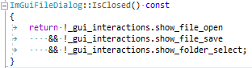
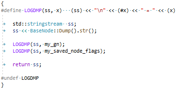

# Code Style

### Pre-amble

This will be a mostly reasoning-free write up, and doesn't cover everything.

Code should read like a book, with well defined structures and placements (think paragraphs, newlines, indentations in a story book).

Exceptions will exist and may not be specified here; if they are highlighted I will be happy to add them.


## Tabs

Tab Policy: **Tabs Indent, Spaces Align** (TISA)



```cpp
	// tab indent
	evtmgr->PushEvent(
		EventType::Domain::Input,
		EventType::Input::KeyChar,
		&data
	);
```
```cpp
	// spaces align the start of text in comment
	 * 2) WMI to plug the majority of gaps; things that are unobtainable
	 *    from the SMBIOS or the system formats/handles, e.g. GPU/NIC
```
```cpp
	// spaces align the similar calls
	data.modifiers.left_alt      = ((SDL_GetModState() & KMOD_LALT) != 0);
	data.modifiers.right_alt     = ((SDL_GetModState() & KMOD_RALT) != 0);
	data.modifiers.left_control  = ((SDL_GetModState() & KMOD_LCTRL) != 0);
	data.modifiers.right_control = ((SDL_GetModState() & KMOD_RCTRL) != 0);
```

This results in having whatever tab width you prefer, and everything stays consistent.

## Macros/Definitions

All Uppercase. For conflict avoidance, we apply our own custom prefix (Trezanik shorthand, TZK).

Prefix: `TZK_`

e.g.
`#define TZK_LOG_FORMAT(ll, fmt, ...)   xyz`

If defined only for a small window, such as the body of a single function, the prefix is optional - but recommended - and it should have an `#undef` to avoid pollution when no longer needed.



## Line-Length

80 columns should be the goal. Accepted exclusions are for things such as:
- very long variable/type names
- comments
- logging methods

Not everyone has a huge width editor, so anything over 120 should be avoided.

`#if 0 // a very long comment exceeding 80 chars; ok as difficult to multi-line`

## Variable Declarations

- Pointer/Reference remains with the type
```cpp
	int*  intptr;
	int&  intref;
```
```cpp
	char*
	dowork(
		char* var
	);
```

- 2 spaces between type and variable name

```cpp
	const char*  osrc = src;
	         // ^ 2 spaces
```

- Prefer alignment of local types, without being ridiculous
```cpp
	auto  lp = dynamic_cast<ListenerPin*>(ng_pin);  // excessive to bring to alignment with PinPosition
	auto  cp = dynamic_cast<ConnectorPin*>(ng_pin);
	PinType      type = PinType::Invalid;  // alignment ok, makes sense
	PinPosition  pos;
	         // ^ 2 spaces
```

## Inclusion Order

Special case: each project has a `definitions.h` file, which must always be first to bring in project-scope definitions. It is always included.

*Note: 'local' headers are always relative to the project root, expected to be a child of /src or similar, and this added to Include Paths*

After that, it operates on the best practice flow:
- Additional Module Inclusions (Visual Studio Project)
- Additional Project Inclusions (Visual Studio Projects within Solution)
- Third-Party Headers
- Operating System Headers
- System Headers

```cpp
	// 1) special case
#include "app/definitions.h"

	// 2) module headers
#include "app/Application.h"
#include "app/Workspace.h"

	// 3) Project headers
#include "core/error.h"

#include "engine/Context.h"

#include "imgui/dear_imgui/imgui.h"

	// 4) Third-Party headers
#include <SDL_version.h>

#if TZK_USING_PUGIXML
#	include <pugixml.hpp>
#endif

	// 5) Operating System headers
#if TZK_IS_WIN32
#	include <Windows.h>
#	include "core/util/winerror.h"
#else
#	include <unistd.h>
#endif

	// 6) System headers
#include <vector>
#include <iostream>
```

## Flow Brackets/Parentheses

Should be on new lines (Allman style). Inline-style items such as lambdas can be excluded.

```cpp
	// OK: on dedicated lines
	if ( main_menu_bar != nullptr )
	{
		main_menu_bar->Draw();
	}
```
```cpp
	// BAD: on shared lines
	if ( main_menu_bar != nullptr ) {
		main_menu_bar->Draw();
	}
```
```cpp
	// OK: initializer, not flow
	EventData::Input_MouseButton  data{ SDLMouseToInternal(evt.button.button) };
	
	// OK: same, but used here due to line length
	GuiInteractions  gui_interactions = {
		*this, *my_context.get(),
		my_context->GetResourceCache(), my_context->GetResourceLoader(),
		my_workspaces_mutex
	};
```


## Classes

PascalCase for both names and methods
```cpp
class Pin
{
...
	virtual void
	CreateLink(
		Pin* other
	) = 0;
...
};
```

## Structures

Lower-case is the norm, but sometimes PascalCase is more appropriate - such as type duplication of a third-party struct
```cpp
// Conventional struct
struct pin
{
	trezanik::core::UUID  id = core::blank_uuid;
	std::string   name;
}

// Duplication of external type
struct PinPosition
{
	float x = 0.f;
	float y = 0.f;
};
```

## Enumerations

Prefer having the datatype specified with each to optimize data storage.

Classic enums - PascalCase
```cpp
enum Audio : Value
{
	Global,
	Action,
	Volume,
	InvalidAudio
};
```

Enum Classes - PascalCase
```cpp
enum class Domain : uint8_t
{
	InvalidDomain = 0,
	Audio        = 1 << 0,
	Engine       = 1 << 1,
	External     = 1 << 2,
	Graphics     = 1 << 3,
	Input        = 1 << 4,
	Interprocess = 1 << 5,
	Network      = 1 << 6,
	System       = 1 << 7,
	AllDomains = (Audio | Engine | External | Graphics | Input | Interprocess | Network | System)
};
```

Where the enums are used as bitwise flags, with no namespace custom wrapping, the enum is declared with a trailing underscore; all members then complete this name with their respective entry.

This completes the full-name declaration, avoids any conflicts with similar names, and retains consistency with determining similar types.

Use a typedef where needing to present a return value/parameter to pass these around:
```cpp
enum LogHints_ : uint8_t
{
	LogHints_None       = 1 << 0,
	LogHints_NoTerminal = 1 << 1,
	LogHints_NoFile     = 1 << 2,
	LogHints_NoSyslog   = 1 << 3,
	LogHints_NoHeader   = 1 << 4,
	LogHints_StdoutNow  = 1 << 5,
};
typedef uint8_t LogHints;
```


## Functions

Return values and parameters are kept on a separate line. Attributes and directives reside on the same line
```cpp
	// header file
	virtual void       // attribute same line with return value
	CreateLink(        // method on its own line
		Pin* other_1,
		Pin* other_2   // parameters each on their own line
	) override;        // attribute same line with statement closure

	// source file
	void
	CreateLink(
		Pin* other_1,
		Pin* other_2
	)
	{
		...
	}
```

C-style functions are generally all lowercase, while those with C++ objects use PascalCase
```cpp
// C style function
const char*
err_as_string(
	errno_ext err
);

// C++ style function
void
NonFunc(
	Object* obj
);
```


## Memory Management

Zero usage of `malloc/realloc/calloc/free`, and `new/delete` except where 100% unavoidable.

C-style allocations must make use of the `TZK_MEM_ALLOC/TZK_MEM_REALLOC/TZK_MEM_FREE` macros, which relay all operations to the memory management service. Leaks will be reported on application closure.
C++ allocations must make use of `shared_ptr` or `unique_ptr`, unless invoking a placement-new operation.

```cpp
	// OK: duplication of c-style string
	size_t  bufsize = strlen(src) + 1;
	char*   retval = static_cast<char*>(TZK_MEM_ALLOC(bufsize));
```
```cpp
	// OK: usage of memory manager directly
	buf = (char*)ServiceLocator::Memory()->Allocate(alloc, TZK_MEM_ALLOC_ARGS);
```
```cpp
	// OK: unavoidable use of new due to initializer list; still safe as directly used within unique_ptr
	my_gui_interactions = std::unique_ptr<GuiInteractions>(new GuiInteractions{ gui_interactions });
```

## Maths Operations

Don't rely on BODMAS/PEMDAS or whatever you were taught. Make the intention explicit, with no room for interpretation error.
```cpp
	// OK: each operation clearly wrapped
	ImGui::SameLine(ImGui::GetWindowWidth() - ((ImGui::GetStyle().ItemSpacing.x * 3) + 75.f));
```
```cpp
	// OK: only one operator despite multiple operations
	return (src - osrc - 1);
```
```cpp
	// OK: only one operation
	ImGui::PushStyleVar(ImGuiStyleVar_Alpha, ImGui::GetStyle().Alpha * 0.5f);
```
```cpp
	// BAD: what was the intention, without obtaining context?
	_main_wnd = newwin(0, 0, LINES - height / 2, COLS - width / 2);
```

## Class members

Member variables are always lowercase, with the following additional criteria:
- Private member variables are prefixed with `my_`
- Protected member variables are prefixed with `_`
- Public member variables must not conflict with naming of private or protected members.

```cpp
class MyClass : public InheritingFrom
{
private:
	// OK: Private member 'my_' prefix
	int   my_integer;
protected:
	// OK: Protected member '_' prefix
	std::vector<Pin>  _connector_pins;
public:
	void MyFunction()
	{
		auto  pin = work();
		
		// Our protected member
		_connector_pins.emplace_back(pin);
		// Deduction without navigating away: this member is inherited
		_pins.emplace_back(pin);
		// Deduction without navigating away: this member is only for this class
		my_integer++;
	}
```

## File Headers

### Source Files

```cpp
/**
 * @file        relative-path-to-file
 * @license     license-details
 * @copyright   copyright-details
 */
```

If the file includes third-party source, it should be noted as appropriate, ensuring the original license information is retained to be compliant.
Best example of this is our strlcpy inclusion, which is taken from OpenBSD and modified for our code style.
```cpp
/**
 * ...standard info as above...
 * @note        Original source by Todd Miller as part of the OpenBSD project.
 *              Modifications made to compile on all platforms and style 
 *              formatting for this project (no functional change).
 *              Original copyright notice in source code.
 */

#include ...headers...

/*	$OpenBSD: strlcpy.c,v 1.12 2015/01/15 03:54:12 millert Exp $	*/

/*
 * Copyright (c) 1998, 2015 Todd C. Miller <Todd.Miller@courtesan.com>
 *
 * ...rest of copyright notice...
 */
```

### Header Files

```cpp
#pragma once

/**
 * @file        relative-path-to-file
 * @brief       one-liner-brief-description
 * @license     license-details
 * @copyright   copyright-details
 */
```


## Exceptions

If ever in doubt, try to be as consistent as possible, and always consider legibility **for others** as the primary goals.

Simpler 10-line code would be preferred rather than a super-optimized 3-line statement if it'll take someone minutes to figure out what it's doing.
