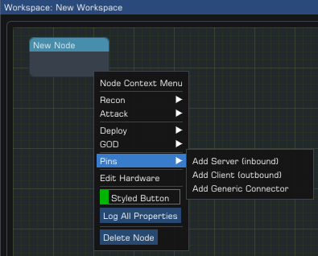
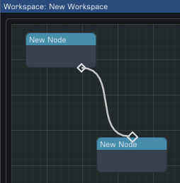

## Isochrone User Manual (Alpha; draft)

> Note:
> The application is still under heavy development, user interface elements are subject to change and may not reflect the current visual state

### Table of Contents

- [Navigating the interface](#Navigating-the-Interface)
- [General Structure](#General-Structure)
- [Creating a Workspace](#Creating-a-Workspace)
- [Loading an existing Workspace](#Loading-an-existing-Workspace)
- [Saving a Workspace](#Saving-a-Workspace)
- [Creating Services and Service Groups](#Creating-Services-and-Service-Groups)
- [Adding a Node](#Adding-a-Node)
- [Adding Pins to a Node](#Adding-Pins-to-a-Node)
- [Adding Links between Pins](#Adding-Links-between-Pins)
- [Removing Nodes/Links/Pins](#Removing-Nodes-Links-Pins)

### <a id="Navigating-the-Interface"></a>Navigating the Interface

Upon launching the application, you will be presented with a menu bar and a log window, at the top and bottom respectively.


The log window is useful for identifying problems either in the application or a specific attempted operation, and is automatically populated by the application. The window can be hidden if not desired.

All starting operations are performed within the menu bar, which has five submenus:

- **Application**
Hosts the preferences and the exit/quit
- **Edit**
Contains workspace editing tools, such as Cut, Copy and Paste alongside Undo and Redo
- **Windows**
Offers the ability to relocate or hide any application-level windows displayed, and enables the dear imgui demo and debug
- **Workspace**
Contains the options for creating, loading and saving workspaces, services, and their own specific window adaptations
- **Help**
Presents the About and Update dialog

With a Workspace opened, you can move the grid around by holding the mouse-scroll button and dragging.


### <a id="General-Structure"></a>General Structure

A Workspace represents a single NodeGraph/Flowchart, which can operate on low-level individual system nodes, or representations of groups via multi-system nodes.
This allows the application to design a topology and general flow for minimal networks, up to medium-sized enterprises.

Workspaces have one or more nodes that are linked together via Pins, with each node able to have an effectively unlimited amount.


Pins can be a general representation of a connection using a Generic Connector pin, or explicit via a Service/Service Group pin.

The object hierarchy looks as follows:
```
Workspace
├── Links
└── Nodes
	└── Pins
```

> Multiple Client pins can link to a single Server pin.
>
> Client pins can link to multiple Server pins.
>
> Generic Connectors can only link to other Generic Connectors.


### <a id="Creating-a-Workspace"></a>Creating a Workspace

Within the main menu bar, select `Workspace` and then `New`.


A file dialog will open prompting for the filename to use (extensions are not automatically added, but these are XML files) - Workspaces are by default stored in your user profiles application data:
- (Windows) `%APPDATA%\trezanik\isochrone\workspaces`
- (Linux) `/home/$username/.config/trezanik/isochrone/workspaces`
You cannot navigate out of this directory within this dialog.


Populate the Name field and click Save; a minimal file will now be stored at this path, with all subsequent save operations writing to this file.

> Note
A selected file will populate its name in the field, and will result in overwriting the original file if saved! This also applies to any names that happen to match existing items.


### <a id="Loading-an-existing-Workspace"></a>Loading an existing Workspace

Within the main menu bar, select `Workspace` and then `Open`.

A file dialog will open, that will allow you to select an existing item within the workspaces directory; this is:
- (Windows) `%APPDATA%\trezanik\isochrone\workspaces`
- (Linux) `/home/$username/.config/trezanik/isochrone/workspaces`
You cannot navigate out of this directory within this dialog.

Select the desired file and click Open. The file will be loaded and the active internal window list updated based on the configuration for the application and within the workspace itself.


### <a id="Saving-a-Workspace"></a>Saving a Workspace

Once a Workspace is opened, it can be saved at any time. The action of saving will overwrite the existing file without prompting, so consider this if the file is also open in another editor.

Within the main menu bar, select `Workspace` and then `Save`. This saves the active workspace, which is the one currently focussed for user modification; only one can be active at a time.

> Note:
> Workspaces are NOT yet automatically saved at any time; if the application were to crash, you were to close the application or simply close the current workspace, all modifications will be lost without prompting


### <a id="Creating-Services-and-Service-Groups"></a>Creating Services and Service Groups

A single dialog controls all service management, with each workspace maintaining their own set. While a Workspace is open, on the main menu bar select `Workspace` and then `Service Management`.


Within this dialog, services are on the right, and service groups on the left. Individual Services can be added to Service Groups once they are defined - but Groups cannot contain other Groups. Services and fields dynamically update based on your selections and edits.


If your workspace was created from a template, you'll have a selection of both pre-defined and available for use, which are generally common items and negates the need to spend too much time here.

For usage instruction, we'll create an example Service Group containing a single Service, using a blank workspace.

1. Under the Services section, Click Add.
2. This will populate the Service section with default values - **Service Name**, protocol **TCP**, and port number of **1**.
3. Edit the name to read `HTTP`, and the Port to read `80`.
4. Upon clicking Save, this will now appear in the Services list. You can continue to make edits to this Service while it is selected within the list. Any modification will block out the other operations until Save or Cancel is pressed.
5. The service is now created and can be used for a Server Pin.


1. Under the Service Groups section, Click Add.
2. This will populate the Service Group section with a default name, with the other fields left empty.
3. Edit the name to read `Common Web`
4. Within the Services section, select the HTTP service you created prior, and then click **Include**, which became available when selecting the service - you'll see the service disappear from the Services list, and appear in the Service Group service list.
5. Click Save in the Service Group section, and you've completed the operation; this service group is now available for use by a Server Pin.


You can edit a service at any time, regardless of its presence in a group or not. Simply select it and make the desired changes.

While doing so, all other fields are disabled until the changes are committed or cancelled:


Additional information:
- Bulk inclusion and exclusion of services is not yet possible.
- You can edit a Service whether or not it is in a Service Group; the code handles updating all necessary objects even if it's in use in other Service Groups.
- The 'To Port' field allows entering a port range, sequential in nature, starting from the 'Port' field. If left at `0`, it is effectively non-existent.
- Saving here does not save the workspace itself! You'll still need to manually save the workspace via the menu.


### <a id="Adding-a-Node"></a>Adding a Node

Within the nodegraph, right-click on any blank area and select **New `$(Type)` Node**; `System` for a singular system, `Multi-System` for multiple systems, and `Boundary` for a logical boundary.


- To resize the node, with the node selected open the Node Properties in the Property View, and edit the **Size** fields; first is x (width), second is y (height). There will be a future ability to drag from the node edges, but is not yet implemented.
- To reposition the node, click and drag on the node header to have it follow the cursor position. It can also be done via the Property View, at the **Position** field pair.


### <a id="Adding-Pins-to-a-Node"></a>Adding Pins to a Node

On a node, right-click to open the Node Context Menu, hover over the Pins submenu, and select the desired pin type:
- `Server`
Listens for incoming connections from clients
- `Client`
Must connect to a Server pin. Represents a client connecting out to a server
- `Generic Connector`
Connects to other Generic Connectors. Ideal for placeholder items until service definitions exist, local network boundaries, or a quick-fire topology




### <a id="Adding-Links-between-Pins"></a>Adding Links between Pins

Left-click + hold, and drag from a Pin; a connector line will be displayed, sourced from the Pin center and ending at the cursor position.



When the click is released, if another Pin is not hovered then the action is effectively aborted.
If another Pin is hovered, then checks are performed to ensure validity:
- Server pins can only link to one or more Client pins
- Generic Connector pins can only link to one or more other Generic Connectors

An attempt to connect to an incompatible Pin will generate an error.

> Note:
> Server Pins can drag out to Client Pins and vice versa.

### <a id="Removing-Nodes-Links-Pins"></a>Removing Nodes/Links/Pins

All deletion/removal operations are handled via context menu selections. On the item of interest, right-click to open the context menu.

Each different type of node, pin, and link have different menu options, including variations depending on state.


As you can see, it's also possible to 'break' a link without having to delete pins or the link itself directly. Breaking a link will perform the same operation as a link deletion.
